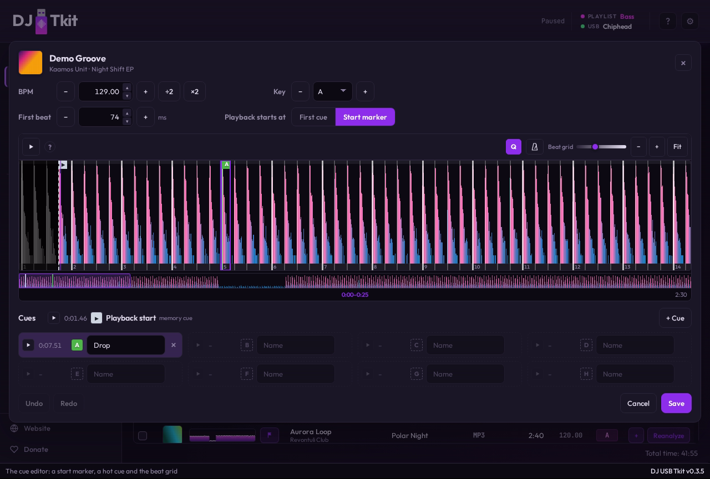
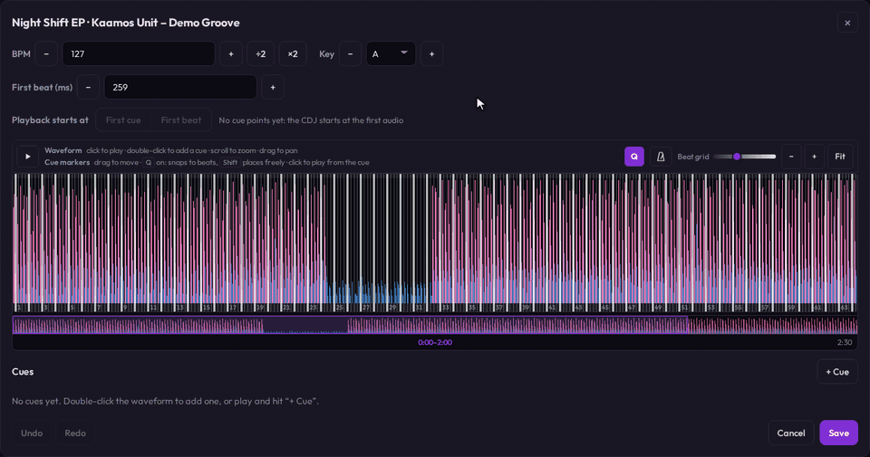
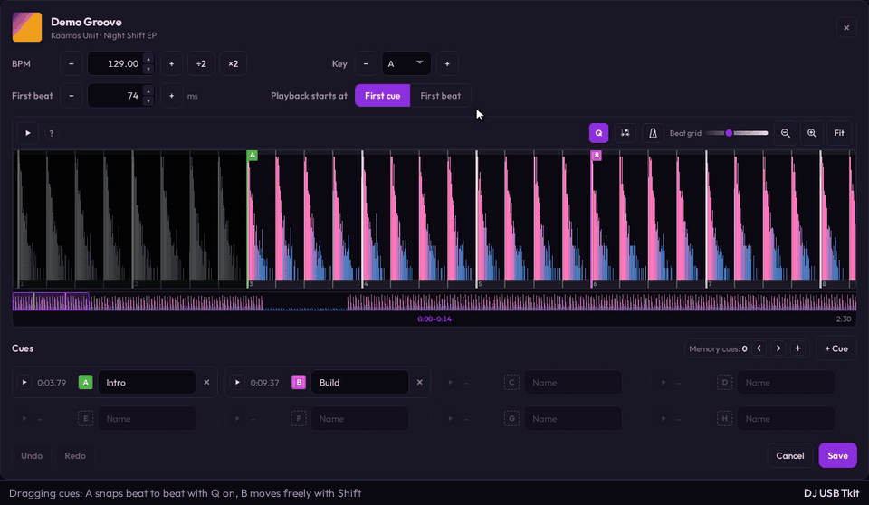
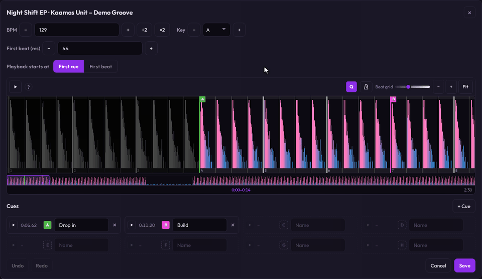

# Cue Editor

## How it works

The cue editor sets a track's cue points, its beat grid (BPM + first beat), its
key, and where a CDJ starts playback. Open it with the magnifier button next to
a track's waveform ("Edit cue points & beat grid") in the library, an app
playlist, a USB playlist, or USB history. The button is disabled until the track
is analyzed. Opened from a USB row, a save writes both the USB and the local
library (see `save_usb_track_analysis_edits` in `docs/COMMANDS.md`). On the USB
that is the ANLZ bundle, `exportLibrary.db` and `export.pdb` (tempo and key), so
every CDJ reads the same values. Opened from the library or an app playlist, a
save writes the library track, which every app playlist containing it shows.

### Beat grid, BPM and key

- **BPM**: type it, nudge it by 0.01 with −/+, or fix a half- or double-tempo
  analysis in one click with ÷2 / ×2.
- **Key**: step through the 24 keys with −/+ or pick one from the list.
- **First beat (ms)**: where the grid starts. Type it or move it one beat at a
  time with −/+ (the field's own arrows step 1 ms).

The grid redraws as you edit, so it can be lined up by eye: here a wrong BPM
(127) drifts off the kicks, 129 runs parallel, typing the first beat puts it on
them, and ± moves the bar starts one beat.

Cues keep their place in the audio when the grid changes, as in rekordbox. To
fix a grid under cues that were placed on it, turn on **Cues follow grid** (the
button next to Q): BPM and first-beat edits then move every cue, the playback
start included, so it stays on its beat, and a cue placed between beats keeps
its offset. One undo puts the grid and the cues back.

### Waveform

The editor shows the full-detail colour waveform, zoomed to the first 60 bars at the track's BPM
on open.

- Scroll to zoom, drag to pan, click to play from that point, double-click to
  add a cue.
- **Beat grid**: a line on every beat. Bar starts (every 4th beat from the first
  beat) are wider and brighter. The lines run into a thin strip above and below
  the waveform, so the beats stay readable where the waveform is loud, and bar
  numbers sit in the strip below (every bar when zoomed in, every 2nd/4th/… bar
  when zoomed out so they never crowd). Lines closer than 8 px would hatch over
  the waveform, so ordinary beat lines are left out until zooming in spreads
  them that far apart (the opening 60-bar view shows bar lines only), and bar
  lines thin to every 2nd/4th/… bar the same way when zoomed far out.
- **Beat grid slider**: how strongly and how thick the grid shows, 0–100
  (default 35, remembered). It mostly sets the ordinary beats (0.5–2 px wide):
  bar starts (2–4 px) always stay visible.
- **Greyed-out start**: everything before where the CDJ will start playback
  (the playback-start marker, else the first cue) is greyed out. With no cues
  nothing is greyed: the CDJ starts at the first audio.
- **Overview strip**: under the waveform, the whole track with the visible part
  boxed and the cues marked. Click or drag it to move the view (zoom kept).
- **Footer**: the visible time range centred ("0:56–1:04", or "Whole track"),
  the track's total time on the right.
- **Hints**: the two usage lines show until the track has a cue; then they fold
  into a "?" whose tooltip also lists the keyboard shortcuts.

### Cue points

A track has up to **8 cue points**, lettered **A–H by position**, the same on
the waveform markers and in the list. Each gets a default name ("Cue N") and
colour when added, both editable. On export each cue point becomes a memory
point **and** a hot-cue pad (see `docs/USB_EXPORT.md`).

- **Add**: double-click the waveform, press "+ Cue" (at the playhead, or where
  playback is paused), or press **C**.
- **Move**: drag a marker. A plain click on a marker plays from that cue.
- **Quantize ("Q")**, on by default and remembered: added and dragged cues snap
  to the nearest beat. Hold **Shift** to place one freely. With Q off it is the
  other way round: Shift snaps.
- **Delete**: × on the cue's row.

### Playback start

"Playback starts at [First cue | First beat]" sets where a CDJ loads the track:

- **First cue**: on cue A (the CDJ's default when a track has hot cues).
- **First beat**: adds a **▶ start marker**, a memory point only (no hot-cue pad,
  no colour, no name), on the first beat. It is listed first and drawn dashed.
  It follows the first beat while untouched. Once dragged elsewhere the choice
  reads **Start marker**. It can never sit after cue A: dragging it past cue A
  stops it there, and dragging cue A before it pushes it back.

The choice is remembered and applied when a track gets its first cue (default:
First cue). With no cues both options are disabled and a note says the CDJ
starts at the first audio.

### Keyboard shortcuts

| Key | Action |
| --- | --- |
| Space | Play / pause |
| C | Add a cue at the playhead (Shift: free placement with Q on) |
| 1–8 | Jump to cue A–H (plays from it and selects it) |
| ← / → | Move the selected cue one beat (with Q on: onto the previous/next beat line) |
| Shift + ← / → | Move the selected cue 10 ms |
| Ctrl+Z | Undo |
| Ctrl+Shift+Z, Ctrl+Y | Redo |
| Escape | Close (only when nothing is unsaved) |

The **selected cue** is the one last added, clicked, dragged or jumped to. It is
outlined on the waveform and highlighted in the list. Keys typed into a cue name
or any other field stay in that field (Ctrl+Z there is the field's own text
undo). Space never presses the focused button (Save has focus on open).

### Playing, pausing and the metronome

- **Play/pause**: the button left of the hints, or Space. Pause holds the track
  in the audio engine; "+ Cue" and C then land on the paused spot. The playhead
  view follows playback when zoomed in, unless you just panned or zoomed.
- **Metronome** (next to Q): clicks on every grid beat while playing, higher and
  louder on bar starts, so you can hear whether the grid lines up. Grid edits
  apply while it plays. It is off each time the editor opens and switches off
  when it closes.
- **Mix** (next to the metronome): balances the music against the clicks. In
  the middle both play at full level; to the left the clicks fade out, to the
  right the music does (all the way right plays the clicks alone). It only
  changes the sound while the metronome is on, applies while playing, and is
  remembered.

### Undo, saving and closing

- **Undo / Redo** (buttons at the bottom left, or the shortcuts) cover BPM,
  key, first beat, the playback-start choice, and every cue change. A typed name
  is one step, and so is one drag. Zoom, pan and the Beat grid slider are views,
  not edits, and are not undone.
- **Save** writes everything; **Cancel** or × discards.
- A click outside the editor or Escape closes it only when nothing is unsaved.
  With unsaved changes the editor stays open and Save pulses. Undoing every edit
  counts as nothing unsaved.

### Remembered settings

| Setting | Default | Storage key / settings key |
| --- | --- | --- |
| Quantize (Q) | on | `djusbtkit.cueQuantize` / `ui_cue_quantize_v1` |
| Cues follow grid | off | `djusbtkit.cueFollowGrid` / `ui_cue_follow_grid_v1` |
| Beat grid slider | 35 | `djusbtkit.cueBeatgridLevel` / `ui_cue_beatgrid_level_v1` |
| Playback start choice for a track's first cue | First cue | `djusbtkit.cueStartOnFirstBeat` / `ui_cue_start_on_first_beat_v1` |
| Metronome Mix slider | 50 (both at full level) | `djusbtkit.cueMetronomeMix` / `ui_cue_metronome_mix_v1` |

Each is kept in `localStorage` and mirrored to the local database through
`set_frontend_setting` (`vanilla-ui/settings_keys.mjs`).

## Deep technical details

The editor loads a track with `get_track_detail` (or `get_usb_track_detail` for
a USB row). Both return the cues ready to edit (every hot cue coloured) and
`keyOptions`, the key picker's Major/Minor groups: exactly the keys a save
accepts. The editor keeps a working copy in the frontend controller
(`vanilla-ui/components/track-detail/actions.mjs`). Nothing is written until
Save, which sends the whole state in one `save_track_analysis_edits` /
`save_usb_track_analysis_edits` call: `firstBeatMs`, `bpm`, `key`, and the full
`cues` list (`{ positionMs, colorId, name, playbackStart }`, playback-start cue
first). The backend replaces the track's cues atomically and rewrites the
cached ANLZ bundle (`backend/src/service/cues.rs`). A USB save sends `cues` only
when they differ from what was opened (`cuesEdited` in the controller); otherwise
it sends `null` and the cues on the stick are left as they are, so a BPM, key or
first-beat edit can't change cues the editor can't represent, such as rekordbox
memory cues.

Undo/redo is editor-local: each edit records a JSON snapshot of the editable
state (`bpm`, `key`, `firstBeatMs`, `cues`) taken before it (`mutate` in the
controller). Consecutive edits sharing a key (one cue's name, one drag, one
held arrow key) collapse into one step; an edit that changes nothing records
nothing. "Unsaved" compares the save payload with the payload as opened.

### Playback-start cue

Stored as a `track_cues` row with `is_playback_start = 1` (`TrackCue.playbackStart`
on the wire; see `docs/APP_DATA_MODEL.md`). It does not count toward the 8. The
backend enforces the same rules as the editor (`normalize_cues`): at most one,
never named or coloured, dropped when the track has no hot cues, and pulled
back to the earliest hot cue when it lies after it.

On export `split_playback_start` writes it as a single memory point before the
hot cues, in both the ANLZ cue chunks and the eDB `cue` table. It is dropped
when it coincides with a hot cue's position, since that hot cue's own memory
point already sits there. On import (`collapse_anlz_cues`), a memory-only entry
that precedes every hot-cue pad is read back as the playback-start cue.

### Metronome

The clicks come from the native playback engine, not the webview. The editor
sends `set_playback_metronome` (`{ enabled, firstBeatMs, bpm, mix }`) whenever
the toggle, the grid or the Mix slider changes, and `enabled: false` on close.
`mix` runs 0..1 (default 0.5): the music's gain is `min(1, 2·(1−mix))` and the
clicks' `min(1, 2·mix)`, so both are at full level in the middle. While the
metronome is off the music passes through untouched.
`backend/src/metronome.rs` wraps every playing track's decoded source in a
`MetronomeSource` that adds a short decaying sine click (1600 Hz on bar starts,
1000 Hz otherwise) to the samples at each grid beat. It tracks its own position
in the track (the playback start offset, reset by seeks), so each click lands
exactly on the beat that is heard, whatever the output latency. The settings are
lock-free atomics shared by `PlaybackController` and the audio thread, so a
toggle or grid edit takes effect while the track plays.

Mixing in the engine also means the metronome needs no webview audio:
WebKitGTK plays web audio through GStreamer's `autoaudiosink`, which may not be
installed.

### Cues follow grid

`moveCuesWithGrid` (in the controller) runs inside the same `mutate` as the BPM
or first-beat edit, so it is one undo step. Each cue's beat is
`(positionMs − firstBeat) / beatInterval` on the grid before the edit, and its
new position is `firstBeat + beat × beatInterval` on the new grid, rounded to
the ms and kept inside the track. The cue remembers the exact beat with the
position and grid it gave (`gridPin`, editor-only, never saved), so many 0.01
BPM steps up and back down land on the same ms. A pin only counts while both
still match, so a cue moved by hand, or a grid edit made with the option off,
starts from the cue's current position. Two hot cues that round onto the same
ms are kept 1 ms apart, and the playback start stays at or before the first hot
cue.

### Drags and text selection

Pointer drags (panning, cue markers, the overview) mark the page unselectable
and cancel `selectstart` until the button is released anywhere
(`vanilla-ui/components/track-detail/events.mjs`). `user-select` rules also
carry the `-webkit-` prefix for WebKitGTK.

Implementation anchors:

- editor state, rendering, undo: `vanilla-ui/components/track-detail/actions.mjs`
- pointer, keyboard and button wiring: `vanilla-ui/components/track-detail/events.mjs`
- waveform drawing: `vanilla-ui/components/track-detail/waveform_detail.mjs`
- cue storage, normalization, ANLZ encoding: `backend/src/service/cues.rs`
- eDB cue rows on export: `backend/src/service/export_helpers/mod.rs`
- metronome mixing: `backend/src/metronome.rs`, `backend/src/player.rs`

## Verification links

- Editor behavior: `vanilla-ui/tests/e2e/track_detail.spec.mjs`
- Cue save/export round-trip, playback-start cue: `backend/tests/user_flow_functional.rs`, `backend/src/service/cues.rs` (unit tests)
- Metronome mixing: `backend/src/metronome.rs` (unit tests); command contract: `backend/tests/core_command_contract_functional.rs`
- Hardware: `docs/HARDWARE_TEST_MATRIX.md` (`cue-points-and-edited-beatgrid`, `playback-start-position`)
