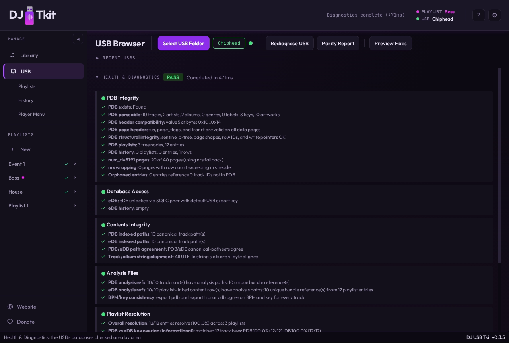
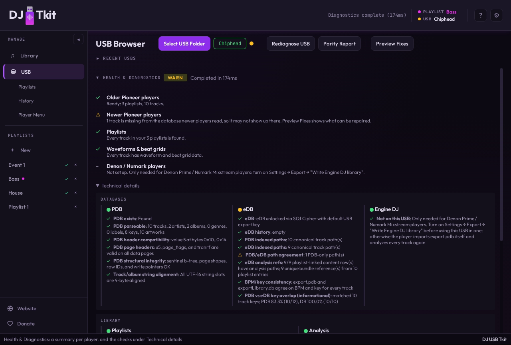
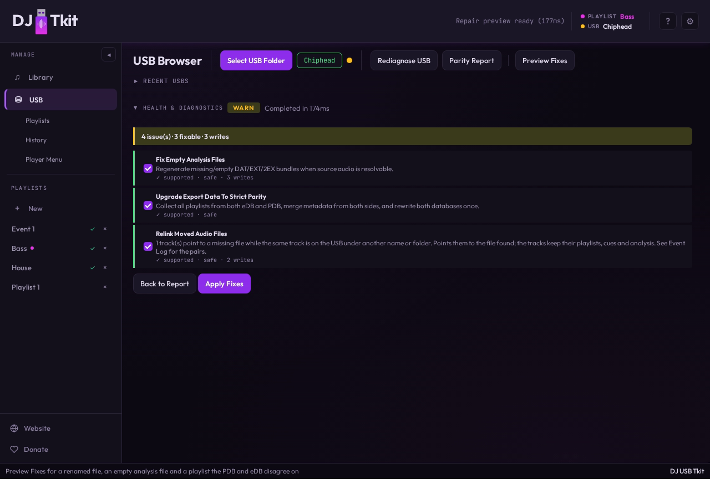

# Diagnostics and Repairs

This document describes USB diagnostics, strict parity reports, and repair
actions implemented by this repository.

## How Diagnostics and Repairs Work

Diagnostics read a USB export and report whether the databases, media paths,
analysis references, playlists, and player menu state look usable. Diagnostics
do not write to the USB.

The report opens with one plain-language line per player family and area. The
individual checks sit under a collapsed **Technical details**, grouped into
Databases (PDB, eDB and Engine DJ side by side), Library and Low-level:

Repairs are separate explicit actions. A repair request can run in preview mode
or apply mode. Preview mode reports proposed fixes, unsupported issues,
estimated writes, and estimated deletes. Apply mode writes only selected fixes,
or the default supported set when no `selectedFixIds` are supplied.

There are two report types:

- `run_usb_diagnostics`: operational USB health and import/export readiness.
- `run_usb_parity_report`: strict PDB/eDB comparison for reproducible player
  compatibility.

In the app, both live on the USB Browser page: once a USB is selected,
**Rediagnose USB**, **Parity Report** and **Preview Fixes** sit next to the
page title, and the report shows under Health & Diagnostics (it scrolls; the
title row stays). The Parity Report opens with a short explanation of what it
compares (the legacy PDB and the new eDB) and what a FAIL means. Preview Fixes
replaces the report with the proposed fixes, each with its own checkbox, and
**Apply Fixes** runs the checked ones.

Operational diagnostics and strict parity are not the same thing. A USB can be
usable on hardware while strict parity still reports differences between PDB
and eDB.

## What Strict Parity Means

A USB export is really two separate databases that both have to be trusted:
`export.pdb` (legacy binary, read as the primary database by older CDJ
hardware) and `exportLibrary.db`/eDB (encrypted SQLite, read as the primary
database by the CDJ-3000; desktop DJ software validates both). See
`docs/PDB.md` "How PDB Works" and `docs/eDB.md` "How eDB Works" for why the
app keeps both instead of one.

Operational diagnostics (`run_usb_diagnostics`) only asks whether *each*
database, taken on its own, looks structurally sound and playable. Strict
parity (`run_usb_parity_report`) asks a stricter, narrower question: does
eDB's view of the library — playlists, membership, order, per-track
metadata, media/analysis paths, dictionary-id resolution — match PDB's view,
field for field. See `## Diagnostic Scope` below for exactly what each report
checks.

These can disagree. A USB can play back correctly on the exact hardware you
tested (passing operational diagnostics) while still failing strict parity —
for example, eDB has a playlist entry PDB doesn't, or a track's BPM differs
between the two files. That gap might not visibly break playback on the one
player you tried, but it is a real divergence: since different players treat
different files as authoritative, the same USB can behave differently
depending on which one it lands on. Strict parity exists to catch that class
of problem before it surfaces as a hardware-specific bug report.

Strict parity is read-only as a report. `upgrade_export_data_to_strict_parity`
is the separate, explicit repair action that reconciles differences by
merging and rewriting both databases to match — see "Repair Flow" below.

## Diagnostic Scope

`run_usb_diagnostics` checks these areas:

| Area | What it checks |
| --- | --- |
| PDB integrity | `export.pdb` exists, parses, has expected header/page state, and has parseable playlists/history |
| eDB access | encrypted DB can be opened, required tables can be read, and history counts can be inspected |
| Contents integrity | PDB and eDB indexed media-path sets agree at DB level |
| Analysis integrity | PDB/eDB analysis-path references exist in database rows |
| Beat grid format (under Analysis integrity) | Always shown. Warns about tracks whose latest export on the stick was written by an app version before 0.3.7 (an export-log record without `appVersion`) and whose `.DAT` still has the old `PQTZ` header. Only those tracks' `.DAT` files are read, and only their first 4 KB. Passes with "no tracks on this USB were exported by this app" when the stick has no export log. When the log can't be read, every track's `.DAT` is checked (first 4 KB each) instead. Points to `fix_beat_grid_header` or a re-export |
| Playlist resolution | playlist rows resolve to tracks across PDB and eDB |
| Player menu divergence | eDB visible menu categories are compared with PDB `t16` kinds |
| Engine DJ library | Without `Engine Library/Database2/m.db`: a passing "Not on this USB" note while "Write Engine DJ library" is off, saying to turn it on before using the USB in an Engine player; nothing while it's on. With one: warns when "Write Engine DJ library" is off, and when `m.db`'s `lastRekordBoxLibraryImportReadCounter` differs from the `export.pdb` header sequence (e.g. after an export from rekordbox itself). Points to `keep_engine_library_up_to_date` |

Operational diagnostics are deliberately DB-focused. They do not walk every
file in `PIONEER/USBANLZ` or validate every analysis file. Repair preview may
run an explicit ANLZ scan when looking for empty or malformed analysis bundles.

`run_usb_parity_report` does deeper comparison:

| Area | What it checks |
| --- | --- |
| Playlist identity | matching playlist ids across PDB and eDB |
| Playlist membership | tracks only in PDB, tracks only in eDB, and duplicate PDB entries |
| Playlist order | common entries appear in the same order within a playlist, and playlist sibling order (PDB `t07.sort_order`) matches eDB `playlist.sequenceNo`; both dimensions are reported together as "Playlist ordering parity" |
| Track metadata | title, artist, album, key, track number, BPM, duration |
| Paths | media path and analysis path parity |
| Artwork | artwork presence on both sides |
| PDB dictionaries | artist, album, key, and artwork ids resolve when linked metadata exists |
| Raw audio coverage | indexed files under `Contents/` exist and extra audio files are reported |
| Rating and colour | a playlist track's star rating and colour match between the eDB and its PDB row (bytes 89/88). Minor: a mismatch warns in the technical details only and doesn't change the overall status. "Upgrade Export Data To Strict Parity" carries the eDB's values into the PDB |

Strict parity can match tracks by normalized media path, analysis path, metadata
fallback, or id fallback depending on which data is available.

## Repair Flow

`repair_usb_diagnostics` runs operational diagnostics first, then strict parity
preview, then builds a repair catalog from the current findings.

When `apply=false`, no files are changed.

When `apply=true`:

- database backups are created before repair writes;
- selected fixes are applied if `selectedFixIds` is non-empty;
- if `selectedFixIds` is empty, all supported non-optional fixes are selected;
- `sync_edb_history_from_pdb` and `keep_engine_library_up_to_date` are optional and are not selected by default;
- `repair_pdb_truncated_table_chain` and `repair_pdb_torn_growth_pages` both run
  *before* strict parity upgrade — `repair_pdb_truncated_table_chain` because
  additive track appends hard-fail while a table's chain is unreachable, and
  `repair_pdb_torn_growth_pages` because its dirty-tail truncation boundary is
  computed once, up front, and would otherwise go stale and cut off
  tracks/playlists that strict parity had just written; all other structural
  PDB page repairs run *after* strict parity upgrade;
- the desktop UI's repair preview locks these two fixes' checkboxes checked
  whenever they're proposed — they cannot be deselected while leaving strict
  parity selected, since there is no safe outcome from skipping either one;
- report commands still remain read-only.

Repair results are returned as applied fixes, skipped fixes, failed fixes,
warnings, estimated writes, and estimated deletes.

## Current Repair Catalog

The current code can propose these repair IDs:

| Repair ID | Applies to | What it does |
| --- | --- | --- |
| `upgrade_export_data_to_strict_parity` | PDB and eDB playlist parity failures | Merges playlists from both databases, preserves membership from both sides, rewrites PDB and eDB through the export writers, removes stale duplicate PDB playlist-entry rows, and syncs eDB `sequenceNo` from PDB `t07.sort_order` |
| `fix_empty_analysis_files` | empty USB analysis files with resolvable source audio | Regenerates `DAT/EXT/2EX` bundles for the affected analysis directory, baking in the track's known PDB tempo/duration (the source file's own length when the PDB has none; a track with no known length is reported as failed). With no known tempo the bundle gets no beat grid |
| `fix_bpm_key_mismatch` | tracks whose eDB `content.bpmx100` or key differs from the PDB `tempo_x100` / key, or whose ANLZ beat-grid tempo (`.DAT`/`.EXT`) differs from the PDB tempo. The automatic diagnosis shows only the database part, as the "BPM/key consistency" check under Analysis Files; the ANLZ files are read only by the repair preview/apply | Rebuilds `PQTZ`/`PQT2` from the PDB tempo and length (the audio file's own length when the PDB has none; with neither, the grid is left alone and a warning names the track) with `apply_analysis_edits_to_anlz` (keeping the bundle's first beat, cues, waveforms and any rekordbox `PSSI`), and sets eDB `bpmx100` and `key_id` from the PDB (key names match sharp/flat-insensitively, as on export). Mismatches are re-detected at apply time, so one pass leaves nothing behind |
| `fix_beat_grid_header` | Bundles under `USBANLZ` whose beat grid is in the pre-0.3.7 app format: a `.DAT` `PQTZ` header with `00000008 00000000` where rekordbox writes `00000000 00080000`, or an `.EXT` `PQT2` whose checksum doesn't match the `PQTZ` beats. Found on disk, not through the PDB; rekordbox bundles never match | Rebuilds `PQTZ` and `PQT2` in rekordbox's format from the grid the `.DAT` already holds (beat times stay within 1 ms), keeping every other chunk byte for byte (`docs/WAVEFORMS.md`, "Beat-grid layout"). A grid that isn't one constant tempo is skipped with a `usb.repair.beat-grid.skipped` warning. Re-detected at apply time |
| `add_missing_mp3_seek_data` | MP3 tracks whose `.DAT` `PVBR` has a zero sample total (app bundles from before 0.3.7; rekordbox's always have the total). Only the bundles are read for the preview | Parses each MP3 on the USB and fills `PVBR` in place, byte for byte as rekordbox writes it, keeping every other chunk (`docs/WAVEFORMS.md`, "Seek-index chunks"). A file whose index can't be reproduced exactly (VBRI, APE/Lyrics3 tags, MPEG-2, lost sync…) is skipped with a `usb.repair.seek-data.skipped` warning naming the file and reason and asking for a report. Re-detected at apply time, so bundles regenerated by `fix_empty_analysis_files` in the same pass are covered |
| `add_missing_flac_seek_data` | FLAC tracks whose `.EXT` has no `PVB2`. Only the bundles are read for the preview | Parses each FLAC on the USB and appends `PVB2` to the `.EXT`. For long tracks about 98% of its entries match rekordbox's (the rest are one frame later), which is why it's a separate fix and not written at analysis. Files that don't parse cleanly are skipped and logged like the MP3 fix |
| `repair_pdb_header_compatibility_field` | PDB header bytes `0x10..0x14` | Writes only that 4-byte field to the built-in compatibility value `5` when the current value is unrecognized; known-compatible values are not repaired just because they differ from a local backup snapshot |
| `repair_pdb_sentinel_u5_on_data_pages` | data pages whose `u5` is sentinel `0x1FFF` | Rewrites `u5` and, only when needed, `num_rl` to the per-table data-page convention |
| `repair_pdb_wrong_page_flags` | data pages with invalid `page_flags` | Patches byte `0x1b` to the accepted value for that table family |
| `repair_pdb_zero_tranrf_on_track_pages` | row-footer groups with active rows and zero `tranrf` | Patches only zero `tranrf` groups; it does not normalize non-zero transaction masks |
| `repair_pdb_wrong_track_u5_num_rl` | invalid active `t00` track-page footer shape | Patches the affected track page footer fields |
| `repair_pdb_wrong_history_page_shape` | `t16`, `t17`, or `t18` pages with `(1, nrs-1)` shape and `nrs > 1` | Changes those pages to `(nrs, 0)`; single-entry pages (`nrs == 1`, where `(1, nrs-1)` and `(nrs, 0)` coincide) are already valid and are not flagged |
| `repair_pdb_stale_sentinel_btree` | sentinel pages with stale B-tree entries | Resets the sentinel B-tree index area to the empty state |
| `repair_pdb_wrong_playlist_tree_shape` | `t07` playlist-tree pages with wrong footer shape | Sets `u5=nrs` and `num_rl=0` |
| `repair_pdb_tombstoned_playlist_tree_ids` | tombstoned `t00` or `t07` slots duplicating active ids | Zeros only the id field in affected tombstoned slots |
| `repair_pdb_t00_multipage_active_pages` | predecessor `t00` pages marked active in a multi-page chain | Sets those pages to sealed flag `0x24` and `(1, nrs-1)` |
| `repair_pdb_ec_data_page_conflict` | table `empty_candidate` pointer aliasing another table's data page | Assigns each conflicting table a new empty candidate beyond the current file tail and updates `next_unused_page` |
| `repair_pdb_torn_growth_pages` | torn additive-growth write left by an interrupted export (e.g. USB disconnected mid-write) | Zeroes `empty_candidate` page(s) that hold garbage instead of a blank reusable page, truncates any never-populated file tail beyond `next_unused_page`, and recomputes `seqdb` |
| `repair_pdb_truncated_table_chain` | a table's declared last page is beyond the physical end of the file (interrupted export left growth pointers ahead of the actual written data) | Points the table's `last`/`empty_candidate` fields back at the real last written page (found by walking the chain); does not touch page content. Applied before strict parity, since additive track appends hard-fail while the chain is unreachable |
| `relink_moved_audio` | a referenced file is missing while the same track sits unindexed under another path (renamed file, moved or re-cased folder) | Pairs missing references with unindexed files by content fingerprint (size + title + artist), else by file name; only one-to-one pairs. Rewrites the PDB track row's path/file name/size in place (same id), updates the eDB `content` row's path, and the bundle's `PPTH`. Applied before the two fixes below, which only see unmatched items |
| `add_unindexed_audio_playlist` | audio files under `Contents/` not indexed by PDB/eDB (e.g. databases restored from an older backup) | Additive export of a USB-only playlist `Unindexed`: tags read from each file, BPM/first beat/cues from the file's canonical ANLZ bundle (bundle reused, not rewritten; files without one are added without analysis). Nothing is copied or deleted |
| `remove_missing_audio_references` | DB references to audio files missing from USB | Removes eDB content/playlist links and PDB playlist entries for references with no candidate file (paired ones are relinked instead) |
| `sync_edb_history_from_pdb` | eDB history counts differ from PDB-derived history payload | Replaces eDB `history` and `history_content` rows from current PDB history data |
| `keep_engine_library_up_to_date` | the USB has an Engine DJ library and "Write Engine DJ library" is off, or the library is behind `export.pdb` | Turns the setting on and rebuilds `m.db` from the PDB, after every other fix and the write-back. Play history (`hm.db`) is kept; changes made on the player in `m.db` (cues, loops, playlists) are replaced. Marked destructive for that reason. Not in the default set when no `selectedFixIds` are given (see `docs/ENGINE_DJ.md`) |

## Unsupported and Manual Cases

Some findings intentionally do not have automatic repairs:

| Finding | Behavior |
| --- | --- |
| malformed entries under `PIONEER/USBANLZ` | reported as unsupported; inspect event-log warnings and re-export affected tracks |
| parity preview unavailable | repair preview continues, but strict parity upgrade is not proposed |

## Player Menu Behavior

Diagnostics can report `usb.diagnostics.cdj-menu-divergence` when eDB
`category` has visible menu kinds missing from PDB `t16`.

Normal playlist export preserves PDB `t16`, `t17`, and `t18` and does not
rewrite eDB `menuItem`, `category`, or `sort` menu state.

Menu commands are separate from diagnostics repair:

| Command | Behavior |
| --- | --- |
| `update_usb_player_menu_config` | treats eDB `category` as the Active Category source, keeps required player menu kinds visible, writes eDB category rows, and updates the PDB `t17` category snapshot when the visible set changes |
| `sync_usb_player_menu_edb_to_pdb` | restores PDB `t16` from the full eDB `menuItem` catalog and updates the PDB `t17` category snapshot |

## Strict Parity Upgrade

`upgrade_export_data_to_strict_parity` uses a collect-merge-write flow:

- parse PDB once;
- read eDB playlists with metadata;
- merge playlist names from both sources;
- preserve existing PDB playlist ids and sort order for matched playlists;
- keep PDB-only playlist members instead of pruning them;
- prefer eDB track metadata when present, falling back to PDB fields;
- write PDB through the current writer;
- remove stale duplicate PDB playlist-entry rows left by prior repairs;
- re-read PDB playlist identities;
- write eDB using the final playlist identity, including syncing
  `sequenceNo` from the current PDB `t07.sort_order` for every playlist.

The strict repair path is intended to converge on rerun. It does not compact
PDB tables, rebuild the entire PDB from scratch, or silently remove playlist
membership that exists on only one side.

## Implementation Anchors

| Area | File |
| --- | --- |
| operational diagnostics | `backend/src/service/diagnostics.rs` |
| strict parity report | `backend/src/service/diagnostics.rs` |
| repair catalog and apply flow | `backend/src/service/repair.rs` |
| PDB/eDB field context | `docs/PDB.md`, `docs/eDB.md` |

`diagnostics.rs`'s PDB reads (integrity checks, parity report) go through the local HDD staging
layer described in `docs/USB_EXPORT.md`'s "Local HDD staging" section, same as export. eDB access
is always staged transparently regardless of caller (`edb::open_edb_from_usb_root`/`open_edb_rw`).

`repair.rs`'s PDB/eDB reads and writes go through the same staging layer: its diagnostic scanners
(`detect_pdb_*`) share one staged read per diagnostics pass, and every `apply_*`/`apply_fix_*`
writer selected in a `repair_usb_diagnostics` apply request writes to the local staged copy only —
`repair_usb_diagnostics_with_progress` flushes both databases back to the real USB drive exactly
once, at the end of the whole apply block, after every selected fix has run (not once per fix).
`update_usb_player_menu_config` and `sync_usb_player_menu_edb_to_pdb` are staged the same way but
are standalone operations outside the apply-batch flow, so each backs up and flushes on its own.

## Verification

Relevant test areas:

- `backend/tests/diagnostics_functional.rs`
- `backend/tests/export_shape_parity_functional.rs`
- `backend/src/service/diagnostics.rs` unit tests
- `backend/src/service/repair.rs` unit tests
- `backend/src/edb.rs` unit tests
- `vanilla-ui/tests/diagnostics_ui_behavior.test.mjs`
- `vanilla-ui/tests/usb_parity_detail.test.mjs`
