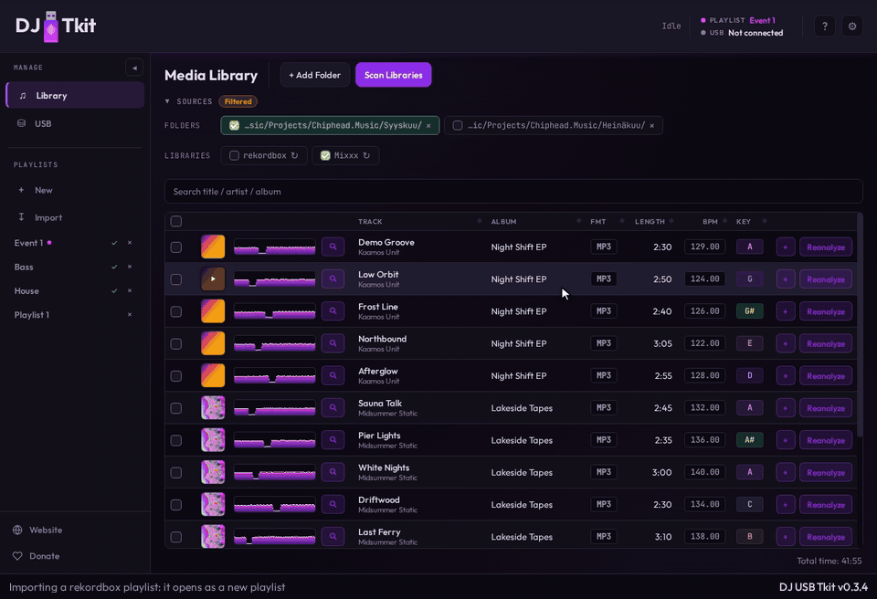

# External Libraries (rekordbox + Mixxx)

## How it works

Besides music folders, the library can take tracks from two DJ applications'
own libraries on the same computer:

- **rekordbox**: the desktop library `master.db`
- **Mixxx**: the library `mixxxdb.sqlite`

Both are found automatically at startup. When one is found, the Media
Library's **Sources** section gets a **Libraries** row (under **Folders**)
with a chip for it: **rekordbox** / **Mixxx**, with an import button (↻, "Import
from rekordbox" / "Import from Mixxx"). The chip's checkbox stays disabled until
that library has been imported. If no music folder has been added yet, the
empty library screen offers the same imports.

Both databases are only ever read. Nothing is written back to rekordbox or
Mixxx, and either application can stay open while importing.

### Importing a library

The chip's ↻ brings every track of that library into the app's library and
turns the chip on:

| | rekordbox | Mixxx |
| --- | --- | --- |
| Title, artist, album | yes | yes |
| Genre | yes | yes |
| BPM, key, length | yes | yes (plus sample rate) |
| Cover image | yes (rekordbox's artwork file) | only a cover image *file* next to the track; embedded covers come from the app's own analysis |
| First beat (beat-grid anchor) | yes, from rekordbox's beat grid | yes, the first beat of Mixxx's beat grid (`BeatGrid-2.0` / `BeatMap-1.0`) |
| Waveform | rekordbox's own analysis files are used in place | no; the app's analysis makes one |
| Hot cues | yes: hot cues (and hot loops) on pads A–H, with colour and name, then memory cues (see below) | yes: hot cues and saved loops on pads 1–8, with colour and label; the main cue becomes the playback-start cue |

Mixxx stores its waveforms in its own format, so Mixxx tracks need the app's
analysis before export, like any folder track. Only the first beat of a Mixxx
beat grid is used; the app's grid is built from it and the BPM. rekordbox tracks
point at rekordbox's analysis files instead.

The first analysis of an imported track keeps the imported BPM and key, so a
tempo or key the DJ corrected in rekordbox or Mixxx isn't lost, and writes
that BPM into the beat grid, starting at the imported first beat. **Reanalyze** on the analyzed track replaces
them with the app's own detection. A BPM you set yourself in the cue editor
behaves the same way. The BPM tooltip shows where the value came from
("From Mixxx", "From rekordbox", "Manually set").

Running an import again updates the tracks already imported. Your own changes
win:

- BPM and key are taken from rekordbox / Mixxx when the track has none, or
  when its value still came from that library, so a tempo you corrected
  there comes across. A value you edited in the app, or that the app's
  analysis replaced (Reanalyze), is kept.
- Length is only filled in when the track has none.
- Title, artist and album follow the library; genre does too when the library
  has one for the track.
- Cues are only added to a track that has no cues in the app.

The playlist import can override this per playlist (see **Force update**
below).

The app's cue list is up to 8 cue points plus one playback-start cue, and
cue points take pads A–H in position order. So an imported hot cue can land on
a different pad letter than in rekordbox or Mixxx if the pads weren't in
position order there.

rekordbox cues are imported hot cues first:

- every hot cue becomes a cue point
- the earliest memory cue becomes the playback-start cue (where a CDJ's
  auto-cue loads the track) when it comes before the first hot cue
- the other memory cues fill the cue points still free, in position order;
  each one is exported as both a memory point and a hot cue
- a memory cue that is a track's only cue becomes a cue point

So a track with only memory cues, as set up for older players, gets its first
memory cue as the playback start and the next 8 as cue points. Memory cues
that don't fit aren't imported; the Event Log counts them. Importing again
brings them in once the app supports more cues.

Some tracks are skipped, with the reason in the Event Log:

- the file isn't found, for example because its drive is unplugged. A track
  imported earlier is kept, with its cues, edits and playlist places; the
  import just doesn't update it
- the file isn't one the library takes, such as a video or a tracker module
  (`.it`, `.xm`, …), the same rule the folder scan uses
- the track was deleted in rekordbox / Mixxx

### Source chips

A library's checkbox only filters the library view: it shows or hides that
library's tracks and never re-imports (the ↻ does that). It can only be
turned on once the library has been imported, which the backend reports with
the library's detection (`imported`). The two chips are independent. A track
that is in both libraries shows when either chip is on.

### Importing a playlist

The **Import** button under **New** in the sidebar's Playlists section appears
when either library is found. It opens a picker listing, per library:

- **rekordbox playlists**, in rekordbox's order. A playlist inside a folder
  shows as `Folder / Name`.
- **rekordbox history**, newest first.
- **Mixxx playlists**, including Auto DJ when it has tracks.
- **Mixxx crates**.
- **Mixxx history** (set logs), newest first.

Only lists with tracks are shown. rekordbox smart playlists aren't listed,
because rekordbox doesn't store their tracks. The line under the list says
where the selected one comes from, for example `Mixxx crate · 3 tracks`.

The chosen list becomes a new playlist with the same name and track order
(Mixxx crates have no order, so their tracks are sorted by artist and title).
Its tracks are imported into the library the same way as with the chip's ↻,
the library's chip is turned on, and the new playlist
opens. A track listed twice is added once. The playlist's header says where
it came from, e.g. `Friday Set (5 tracks, Total time: 14:05) · Imported from
rekordbox`.

If none of the list's tracks can be imported, for example a rekordbox library
from another computer whose file paths don't exist here, no playlist is
created and the status line says why.

**Importing a list again** updates the playlist its first import made instead
of creating another one: its tracks and their order are replaced with the
current ones from rekordbox / Mixxx, its name is kept (even if you renamed it),
and its USB export status is cleared. The line under the list says so, for
example `Mixxx playlist · 5 tracks · updates your playlist "Friday Set"`.
Changes you made to that playlist in the app are replaced. A playlist you
delete is created again on the next import.

**Force update track data from rekordbox / Mixxx** (a checkbox, off by
default) makes the playlist's tracks take BPM, key and cues from the library
even where you edited them or reanalyzed them in the app. Cues are only
replaced when the library has cues for the track. The analysis files on the
USB follow on the next export, which rebuilds each track's beat grid and cues
from the app's values.

### When both libraries have the same file

Tracks are matched by file path, so a file in both libraries is one track in
the app:

- it carries both source flags and shows when either chip is on
- title, artist and album: whichever import ran last
- BPM, key, length: the first value found is kept
- waveform: rekordbox's analysis file
- cover image: whichever import copied one last
- hot cues: from whichever import finds the track without cues first

## Deep technical details

### Where the databases are looked for

| Library | Environment override | Locations tried, in order |
| --- | --- | --- |
| rekordbox | `DJUSBTKIT_MASTER_DB_PATH` | macOS `~/Library/Application Support/Pioneer DJ/rekordbox/master.db`, then `~/Library/Application Support/Pioneer/rekordbox/master.db`, then `~/Library/Pioneer/rekordbox/master.db`; Windows `%APPDATA%\Pioneer\rekordbox\master.db` (or the same under `%USERPROFILE%\AppData\Roaming`) |
| Mixxx | `DJUSBTKIT_MIXXX_DB_PATH` | Linux `~/.mixxx/mixxxdb.sqlite`; macOS `~/Library/Containers/org.mixxx.mixxx/Data/Library/Application Support/Mixxx/mixxxdb.sqlite`, then `~/Library/Application Support/Mixxx/mixxxdb.sqlite`; Windows `%LOCALAPPDATA%\Mixxx\mixxxdb.sqlite` |

`master.db` is SQLCipher-encrypted with rekordbox's fixed desktop key.
`mixxxdb.sqlite` is plain SQLite. Both are opened with
`SQLITE_OPEN_READ_ONLY`.

### Code layout

- `backend/src/service/rekordbox_import.rs`: `scan_master_db`,
  `list_rekordbox_playlists`, `import_rekordbox_playlist`
- `backend/src/service/mixxx_import.rs`: `detect_external_mixxx_db`,
  `scan_mixxx_db`, `list_mixxx_playlists`, `import_mixxx_playlist`

Each module has one per-track importer (`MasterDbTrackImporter`,
`MixxxTrackImporter`) that the whole-library import and the playlist import
share, so a track is treated the same whichever way it arrives. The playlist
import runs in one transaction; when it finds no importable track it returns
an error before creating the playlist, which also rolls back the track
upserts.

`playlists.import_source` records where an imported playlist came from, as
`<library>:<kind>:<id>` (for example `mixxx:crate:4`; Mixxx playlist and crate
ids overlap). The list commands return the matching local playlist as
`existingPlaylist`, and an import saves into it (`save_imported_playlist`).

`tracks.master_db_source` and `tracks.mixxx_db_source` record where a track
came from. An import that fills in a track's BPM, key or first beat sets
`bpm_analyzer` / `tonality_source` / `first_beat_ms_source` to `rekordbox` or
`mixxx` (a cue-editor edit sets `user`), only over a value that is missing or
came from the same library, unless forced. `analysis::kept_analysis_values` keeps a value with one of those
sources when the track has no waveform yet (its first analysis); a track that
already has one is reanalyzed and gets the detected values. The library filter requests (`browse_source_files`,
`list_matching_track_ids`, `add_library_selection_to_playlist`,
`analyze_new_tracks`) carry `includeMasterDb` / `includeMixxxDb`; a track is
included when `(includeMasterDb && masterDbSource) || (includeMixxxDb &&
mixxxDbSource)`.

### rekordbox `master.db` fields read

- Tracks: `djmdContent` (text `ID`; `FolderPath` is the full file path;
  `BPM` is centi-BPM; `Length` in seconds), joined to `djmdArtist`,
  `djmdAlbum`, `djmdKey.ScaleName` and (when the schema has it)
  `djmdGenre.Name` via `GenreID`. `AnalysisDataPath` / `ImagePath` are
  `/PIONEER/...` paths under rekordbox's `share` folder.
- Playlists: `djmdPlaylist` (`Attribute` 0 = playlist, 1 = folder,
  4 = smart playlist; top level has `ParentID = 'root'`; ordered by `Seq`)
  and `djmdSongPlaylist` (`PlaylistID`, `ContentID`, ordered by `TrackNo`).
- Cues: `djmdCue` (`ContentID`, `InMsec` in milliseconds, `Comment`,
  `ColorTableIndex`). `Kind` 0 is a memory cue and hot-cue pads A–H are
  `Kind` 1, 2, 3, 5, 6, 7, 8, 9 (rekordbox skips 4). Hot cues become cue
  points; the earliest memory cue becomes the playback-start cue when it lies
  before the first hot cue (with no hot cues, when another memory cue
  follows); the other memory cues fill the free cue points by position, and
  one at a hot cue's position merges into it. `ColorTableIndex` is read with the same codes the
  app writes to the USB eDB's `cue.colorTableIndex` (its palette ids 1–8);
  unset or other values get the default colour. Colours set in rekordbox are
  not yet validated against real data.
- History: `djmdHistory` (sessions are `Attribute` 0 under year / month
  folders; newest first by `DateCreated`) and `djmdSongHistory`
  (`HistoryID`, `ContentID`, `TrackNo`).
- Rows with `rb_local_deleted = 1` are ignored everywhere.

### Mixxx `mixxxdb.sqlite` fields read

- Tracks: `library` joined to `track_locations` on `library.location`;
  rows with `library.mixxx_deleted` or `track_locations.fs_deleted` set are
  ignored. `duration` is in seconds, `bpm` a float; `genre` is read when the
  column exists.
- Key: `library.key_id` is Mixxx's ChromaticKey (1–12 = C..B major, 13–24 =
  Cm..Bm minor), mapped to the app's classic key names. When it's unset, the
  `key` text is used if it's a key the app recognises; Mixxx writes that text
  in the user's chosen notation (`Am`, `8A`, `1m`, …).
- Cover: `coverart_type = 2` (file) with `coverart_location` relative to the
  track's folder (or absolute). Embedded covers (`coverart_type = 1`) are
  left to analysis.
- Cues: `cues.type` 1 (hot cue) and 4 (saved loop) with `hotcue >= 0`
  become cue points, at most 8. With more pads set, the lowest-numbered
  pads (`hotcue` 0-7 = pads 1-8) win; the kept cues are ordered by position,
  one per position. Type 2 (main cue) becomes the playback-start cue when it lies
  before the first hot cue. Intro, outro and other markers are ignored.
  `position` is in interleaved stereo samples:
  `ms = position / (2 × samplerate) × 1000`. `color` (`0xRRGGBB`) maps to the
  nearest colour of the app's cue palette.
- Playlists: `Playlists.hidden` 0 = playlist, 1 = Auto DJ, 2 = history set
  log (others, such as the history placeholder, are skipped), with
  `PlaylistTracks` ordered by `position`. Crates: `crates` +
  `crate_tracks`.
- Columns that older Mixxx versions lack (`key_id`, `coverart_*`,
  `mixxx_deleted`, `fs_deleted`) are read as `NULL`.

Validated against Mixxx 2.5.6 and a rekordbox 6 `master.db`.
